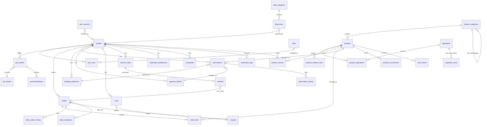

# 🐾 MasKot - Product Backlog

> Plataforma de nutrición personalizada para mascotas basada en Nutri Co.
> **Stack:** React 19 + Vite + TypeScript + Tailwind CSS + Supabase

---

## 📋 Índice de Módulos

1. [Identidad y Landings](#módulo-1-identidad-y-landings)
2. [Conversión - Nutri-Quiz](#módulo-2-conversión-nutri-quiz)
3. [Tienda E-commerce](#módulo-3-tienda-e-commerce)
4. [Checkout y Suscripción](#módulo-4-checkout-y-suscripción)
5. [Legal y Compliance](#módulo-5-legal-y-compliance-perú)
6. [Administración Back-office](#módulo-6-administración-back-office)
7. [Módulos Complementarios](#módulo-7-complementarios)

---

## Módulo 1: Identidad y Landings

### HU-1.1: Home Page con Hero Dinámico

**User Story:** Como visitante, quiero ver una página de inicio atractiva con información clara, para entender el valor de la nutrición personalizada.

**Criterios de Aceptación:**

- [ ] Hero banner dinámico con título, subtítulo y CTA "Descubre su plan ideal"
- [ ] Sección comparador de costos: comida tradicional vs MasKot
- [ ] Slider interactivo para simular ahorro según peso/edad de mascota
- [ ] Sección "Cómo funciona" en 3 pasos con iconos e ilustraciones
- [ ] Carrusel de testimonios con foto de mascota, nombre del dueño y rating
- [ ] Mostrar testimonios destacados (configurables desde admin)
- [ ] Banner CTA final con llamado a acción hacia el Quiz
- [ ] Loading skeleton mientras cargan datos dinámicos
- [ ] Mobile-first responsive

**UI/UX:** Hero gradient animado, slider interactivo peso/edad, cards de testimonios con rating, CTA flotante mobile

**Frontend:** `src/features/home/pages/LandingPage.tsx` + `homePageService.ts`

**Supabase (`cms_logic.sql`):**

```sql
CREATE TABLE testimonials (
    id BIGINT GENERATED BY DEFAULT AS IDENTITY PRIMARY KEY,
    pet_name TEXT NOT NULL,
    pet_photo_url TEXT,
    owner_name TEXT NOT NULL,
    content TEXT NOT NULL,
    rating INTEGER NOT NULL CHECK (rating BETWEEN 1 AND 5),
    is_featured BOOLEAN NOT NULL DEFAULT FALSE,
    created_at TIMESTAMPTZ NOT NULL DEFAULT NOW()
);

CREATE TABLE home_page_config (
    id INTEGER PRIMARY KEY CHECK (id = 1),
    hero_section JSONB NOT NULL DEFAULT '{}'::jsonb,
    cost_comparison_section JSONB NOT NULL DEFAULT '{}'::jsonb,
    how_it_works_section JSONB NOT NULL DEFAULT '{}'::jsonb,
    cta_banner_section JSONB NOT NULL DEFAULT '{}'::jsonb,
    updated_at TIMESTAMPTZ NOT NULL DEFAULT NOW()
);

-- RPC: Calcular ahorro proyectado según peso y edad (usado en slider interactivo)
CREATE OR REPLACE FUNCTION calculate_cost_savings(
    p_pet_weight_kg NUMERIC,
    p_pet_age_months INTEGER
) RETURNS JSONB AS $$
    -- Retorna: { monthly_traditional, monthly_maskot, savings_monthly, savings_yearly, savings_pct }
$$ LANGUAGE plpgsql SECURITY INVOKER;
```

---

### HU-1.2: Página "Nosotros"

**User Story:** Como visitante, quiero conocer la filosofía y equipo de MasKot, para generar confianza antes de comprar.

**Criterios de Aceptación:**

- [ ] Hero banner con título y subtítulo de la página
- [ ] Sección Misión/Visión con animaciones al scroll
- [ ] Sección explicativa del Motor de IA nutricional
- [ ] Timeline interactivo de historia de la empresa
- [ ] Grid de miembros del equipo con foto, nombre, rol y LinkedIn
- [ ] Galería de certificaciones y avales veterinarios
- [ ] Banner CTA final con llamado a acción
- [ ] Loading skeleton mientras cargan datos dinámicos
- [ ] Mobile-first responsive

**UI/UX:** Parallax suave en imágenes, cards de equipo con hover effect, timeline vertical en mobile, badges de certificaciones

**Frontend:** `src/features/about/pages/AboutPage.tsx` + `aboutPageService.ts`

**Supabase (`cms_logic.sql`):**

```sql
CREATE TABLE team_members (
    id BIGINT GENERATED BY DEFAULT AS IDENTITY PRIMARY KEY,
    full_name TEXT NOT NULL,
    role TEXT NOT NULL,
    photo_url TEXT,
    bio TEXT,
    linkedin_url TEXT,
    display_order INTEGER NOT NULL DEFAULT 0 CHECK (display_order >= 0)
);

-- Configuración de Página "Nosotros" (CMS Singleton)
CREATE TABLE about_page_config (
    id INTEGER PRIMARY KEY CHECK (id = 1),
    -- Sección Hero
    hero_section JSONB NOT NULL DEFAULT '{}'::jsonb,
    -- Misión y Visión
    mission_vision_section JSONB NOT NULL DEFAULT '{}'::jsonb,
    -- Explicación del Motor de IA
    ai_engine_section JSONB NOT NULL DEFAULT '{}'::jsonb,
    -- Timeline de Historia
    timeline_section JSONB NOT NULL DEFAULT '{}'::jsonb,
    -- Banner CTA final
    cta_banner_section JSONB NOT NULL DEFAULT '{}'::jsonb,
    updated_at TIMESTAMPTZ NOT NULL DEFAULT NOW()
);

CREATE TABLE certifications (
    id BIGINT GENERATED BY DEFAULT AS IDENTITY PRIMARY KEY,
    name TEXT NOT NULL,
    logo_url TEXT,
    description TEXT,
    display_order INTEGER NOT NULL DEFAULT 0 CHECK (display_order >= 0)
);
```

---

### HU-1.3: Blog Educativo con CMS

**User Story:** Como visitante, quiero acceder a contenido educativo sobre nutrición de mascotas.

**Criterios de Aceptación:**

- [ ] Listado de artículos con paginación (12/página)
- [ ] Cards con imagen destacada, título, excerpt y tiempo de lectura
- [ ] Filtros por categoría
- [ ] Búsqueda por título/contenido
- [ ] Vista de artículo individual con slug SEO-friendly
- [ ] Tabla de contenidos (TOC) sticky en desktop
- [ ] Autor del artículo con avatar y nombre
- [ ] Artículos relacionados al final
- [ ] SEO: meta_title, meta_description, schema markup
- [ ] Estados de artículo: borrador, publicado, archivado
- [ ] Share buttons (WhatsApp, Facebook, Copy link)
- [ ] Loading skeleton mientras cargan datos

**UI/UX:** Cards con hover effect, sticky TOC en sidebar, breadcrumb de navegación, responsive mobile-first

**Frontend:** `src/features/blog/pages/BlogListPage.tsx`, `BlogPostPage.tsx` + `blogService.ts`

**Supabase (`blog_logic.sql`):**

```sql
CREATE TYPE blog_post_status AS ENUM ('draft', 'published', 'archived');

CREATE TABLE blog_categories (
    id BIGINT GENERATED BY DEFAULT AS IDENTITY PRIMARY KEY,
    name TEXT NOT NULL,
    slug TEXT NOT NULL UNIQUE,
    description TEXT
);

CREATE TABLE blog_posts (
    id BIGINT GENERATED BY DEFAULT AS IDENTITY PRIMARY KEY,
    slug TEXT NOT NULL UNIQUE,
    title TEXT NOT NULL,
    excerpt TEXT,
    content TEXT NOT NULL,
    featured_image_url TEXT,
    category_id BIGINT REFERENCES blog_categories(id) ON DELETE SET NULL,
    author_id UUID REFERENCES profiles(id) ON DELETE SET NULL,
    read_time_minutes INTEGER NOT NULL DEFAULT 5 CHECK (read_time_minutes > 0),
    meta_title TEXT,
    meta_description TEXT,
    status blog_post_status NOT NULL DEFAULT 'draft',
    published_at TIMESTAMPTZ,
    created_at TIMESTAMPTZ NOT NULL DEFAULT NOW(),
    updated_at TIMESTAMPTZ NOT NULL DEFAULT NOW()
);
```

---

## Módulo 2: Conversión (Nutri-Quiz)

### HU-2.1: Flujo Multi-Paso del Quiz

**User Story:** Como usuario, quiero completar un cuestionario sobre mi mascota para recibir un plan nutricional personalizado.

**Criterios de Aceptación:**

- [ ] Paso 1: Tipo de mascota (Perro/Gato)
- [ ] Paso 2: Nombre, edad, raza
- [ ] Paso 3: Peso actual y objetivo
- [ ] Paso 4: Nivel de actividad
- [ ] Paso 5: Condiciones especiales (alergias)
- [ ] Paso 6: Preferencias de sabor
- [ ] Barra de progreso visible
- [ ] Guardado en sessionStorage
- [ ] Validación en tiempo real
- [ ] Lógica de saltos: alergias → selector específico

**UI/UX:** Transiciones slide, ilustraciones por paso, botones grandes mobile, tooltips

**Frontend:** `src/features/quiz/pages/NutriQuizPage.tsx` + componentes por paso

**Supabase (`quiz_logic.sql`):**

```sql
CREATE TYPE pet_type AS ENUM ('dog', 'cat');
CREATE TYPE pet_size_category AS ENUM ('toy', 'small', 'medium', 'large', 'giant');
CREATE TYPE activity_level AS ENUM ('sedentary', 'moderate', 'active', 'very_active');

CREATE TABLE pet_breeds (
    id BIGINT GENERATED BY DEFAULT AS IDENTITY PRIMARY KEY,
    pet_type pet_type NOT NULL,
    name TEXT NOT NULL,
    avg_weight_kg NUMERIC(5, 2) CHECK (avg_weight_kg > 0),
    size_category pet_size_category NOT NULL
);

CREATE TABLE health_conditions (
    id BIGINT GENERATED BY DEFAULT AS IDENTITY PRIMARY KEY,
    name TEXT NOT NULL UNIQUE,
    description TEXT,
    excluded_ingredients TEXT[] NOT NULL DEFAULT '{}'
);

CREATE TABLE flavor_preferences (
    id BIGINT GENERATED BY DEFAULT AS IDENTITY PRIMARY KEY,
    name TEXT NOT NULL UNIQUE,
    icon_url TEXT
);

CREATE TABLE quiz_sessions (
    id BIGINT GENERATED BY DEFAULT AS IDENTITY PRIMARY KEY,
    session_token TEXT NOT NULL UNIQUE,
    user_id UUID REFERENCES profiles(id) ON DELETE SET NULL,
    pet_type pet_type,
    current_step INTEGER NOT NULL DEFAULT 1 CHECK (current_step >= 1),
    answers JSONB NOT NULL DEFAULT '{}'::jsonb,
    started_at TIMESTAMPTZ NOT NULL DEFAULT NOW(),
    completed_at TIMESTAMPTZ
);
```

---

### HU-2.2: Motor de Recomendación IA

**User Story:** Como sistema, quiero procesar las respuestas del quiz para generar una recomendación nutricional.

**Criterios de Aceptación:**

- [ ] Cálculo de requerimiento calórico diario (fórmula RER/MER)
- [ ] Obtener fórmulas base según perfil de la mascota
- [ ] Exclusión automática de ingredientes según condiciones de salud
- [ ] Selección de fórmula según edad, peso y nivel de actividad
- [ ] Generación de score de compatibilidad (0-100) por producto
- [ ] Ajuste de porciones según peso objetivo
- [ ] Tiempo de procesamiento < 2 segundos
- [ ] Manejo de errores con fallback si el motor falla

**UI/UX:** Animación de "calculando..." mientras procesa, indicador de progreso

**Frontend:** `src/features/quiz/services/nutritionEngineService.ts`

**Supabase (`quiz_logic.sql`):**

```sql
CREATE TABLE nutrition_formulas (
    id BIGINT GENERATED BY DEFAULT AS IDENTITY PRIMARY KEY,
    name TEXT NOT NULL,
    base_ingredients TEXT[] NOT NULL DEFAULT '{}',
    suitable_conditions BIGINT[] DEFAULT '{}',
    kcal_per_100g INTEGER NOT NULL CHECK (kcal_per_100g > 0),
    protein_pct NUMERIC(5, 2) NOT NULL CHECK (protein_pct BETWEEN 0 AND 100),
    fat_pct NUMERIC(5, 2) NOT NULL CHECK (fat_pct BETWEEN 0 AND 100),
    fiber_pct NUMERIC(5, 2) NOT NULL CHECK (fiber_pct BETWEEN 0 AND 100)
);

-- RPC: Calcular nutrición basada en respuestas del quiz
CREATE OR REPLACE FUNCTION calculate_pet_nutrition(p_quiz_answers JSONB)
RETURNS JSONB AS $$
    -- Input: { weight_kg, activity_level, pet_type, birth_date, health_conditions[] }
    -- Retorna: { daily_kcal, rer, mer, activity_factor, excluded_ingredients[], suitable_formulas[] }
$$ LANGUAGE plpgsql SECURITY DEFINER;

-- RPC: Obtener productos recomendados con score de compatibilidad
CREATE OR REPLACE FUNCTION get_recommended_products(
    p_pet_profile_id BIGINT,
    p_limit INTEGER DEFAULT 10
) RETURNS JSONB AS $$
    -- Retorna: [{ product_id, name, price, match_score, is_compatible }]
$$ LANGUAGE plpgsql SECURITY INVOKER;
```

---

### HU-2.3: Reporte de Diagnóstico

**User Story:** Como usuario, quiero ver un reporte visual del análisis de mi mascota.

**Criterios de Aceptación:**

- [ ] Card resumen del perfil: nombre, tipo, raza, peso, actividad
- [ ] Mostrar requerimiento calórico diario calculado
- [ ] Gráfico radar de necesidades nutricionales (proteína, grasa, fibra)
- [ ] Comparación visual: Comida tradicional vs MasKot
- [ ] Cálculo de ahorro mensual proyectado
- [ ] Score de nutrición (0-100)
- [ ] Lista de productos recomendados con % de match
- [ ] Botón "Guardar perfil" (requiere login)
- [ ] Botón "Agregar al carrito" directo desde recomendación
- [ ] Compartir reporte por WhatsApp/Email
- [ ] Descargar reporte en PDF
- [ ] Modal de registro/login si usuario no está autenticado

**UI/UX:** Animación inicial de loading, gráficos con Recharts/Chart.js, highlight del ahorro en verde, confetti al guardar

**Frontend:** `src/features/quiz/pages/DiagnosticReportPage.tsx` + `petProfileService.ts`

**Supabase (`pets_logic.sql`):**

```sql
CREATE TABLE pet_profiles (
    id BIGINT GENERATED BY DEFAULT AS IDENTITY PRIMARY KEY,
    user_id UUID NOT NULL REFERENCES profiles(id) ON DELETE CASCADE,
    name TEXT NOT NULL,
    pet_type pet_type NOT NULL,
    breed_id BIGINT REFERENCES pet_breeds(id) ON DELETE SET NULL,
    birth_date DATE,
    weight_kg NUMERIC(5, 2) NOT NULL CHECK (weight_kg > 0),
    target_weight_kg NUMERIC(5, 2) CHECK (target_weight_kg > 0),
    activity_level activity_level NOT NULL DEFAULT 'moderate',
    health_conditions BIGINT[] DEFAULT '{}',
    flavor_preferences BIGINT[] DEFAULT '{}',
    daily_kcal_requirement INTEGER CHECK (daily_kcal_requirement > 0),
    created_at TIMESTAMPTZ NOT NULL DEFAULT NOW(),
    updated_at TIMESTAMPTZ NOT NULL DEFAULT NOW()
);

CREATE TABLE recommendations (
    id BIGINT GENERATED BY DEFAULT AS IDENTITY PRIMARY KEY,
    pet_profile_id BIGINT NOT NULL REFERENCES pet_profiles(id) ON DELETE CASCADE,
    recommended_products JSONB NOT NULL DEFAULT '[]'::jsonb,
    savings_monthly NUMERIC(10, 2) CHECK (savings_monthly >= 0),
    nutrition_score INTEGER CHECK (nutrition_score BETWEEN 0 AND 100),
    generated_at TIMESTAMPTZ NOT NULL DEFAULT NOW()
);

-- RPC: Generar reporte de diagnóstico completo
CREATE OR REPLACE FUNCTION generate_diagnostic_report(p_quiz_session_id BIGINT)
RETURNS JSONB AS $$
    -- Retorna: { pet_summary, nutrition_requirements, savings_comparison, recommended_products[], nutrition_score }
$$ LANGUAGE plpgsql SECURITY INVOKER;

-- RPC: Guardar perfil de mascota desde quiz (requiere auth)
CREATE OR REPLACE FUNCTION save_pet_profile_from_quiz(
    p_quiz_session_id BIGINT,
    p_pet_name TEXT
) RETURNS BIGINT AS $$
    -- Retorna: pet_profile_id creado
$$ LANGUAGE plpgsql SECURITY DEFINER;
```

---

## Módulo 3: Tienda (E-commerce)

### HU-3.1: Catálogo Personalizado

**User Story:** Como usuario con mascota, quiero ver productos filtrados según sus necesidades.

**Criterios de Aceptación:**

- [ ] Listado de productos con cards: imagen, nombre, precio, rating promedio
- [ ] Mostrar solo productos compatibles con perfil de mascota activo
- [ ] Excluir productos con ingredientes no aptos según condiciones de salud
- [ ] Badge "Recomendado para [nombre mascota]" en productos con alto match
- [ ] Filtros por: categoría, rango de precio, tipo de alimento
- [ ] Ordenar por: relevancia, precio (asc/desc), popularidad
- [ ] Vista grid/lista toggle
- [ ] Selector de mascota activa en header (si tiene múltiples mascotas)
- [ ] Lazy loading de imágenes
- [ ] Skeleton loaders mientras cargan datos
- [ ] Estado vacío si no hay productos compatibles

**UI/UX:** Cards con hover effect y quick-add button, filtros colapsables en mobile, sticky filters en desktop

**Frontend:** `src/features/store/pages/CatalogPage.tsx` + `productService.ts`

**Supabase (`store_logic.sql`):**

```sql
CREATE TYPE product_status AS ENUM ('draft', 'active', 'out_of_stock', 'discontinued');
CREATE TYPE product_type AS ENUM ('dry_food', 'wet_food', 'topper', 'snack', 'supplement');

CREATE TABLE product_categories (
    id BIGINT GENERATED BY DEFAULT AS IDENTITY PRIMARY KEY,
    name TEXT NOT NULL,
    slug TEXT NOT NULL UNIQUE,
    parent_id BIGINT REFERENCES product_categories(id) ON DELETE SET NULL,
    display_order INTEGER NOT NULL DEFAULT 0 CHECK (display_order >= 0)
);

CREATE TABLE products (
    id BIGINT GENERATED BY DEFAULT AS IDENTITY PRIMARY KEY,
    sku TEXT NOT NULL UNIQUE,
    name TEXT NOT NULL,
    slug TEXT NOT NULL UNIQUE,
    description TEXT,
    short_description TEXT,
    price NUMERIC(10, 2) NOT NULL CHECK (price > 0),
    compare_at_price NUMERIC(10, 2) CHECK (compare_at_price > 0),
    images TEXT[] NOT NULL DEFAULT '{}',
    pet_type pet_type,
    product_type product_type NOT NULL,
    category_id BIGINT REFERENCES product_categories(id) ON DELETE SET NULL,
    suitable_conditions BIGINT[] DEFAULT '{}',
    excluded_ingredients TEXT[] DEFAULT '{}',
    weight_options JSONB NOT NULL DEFAULT '[]'::jsonb,
    subscription_available BOOLEAN NOT NULL DEFAULT TRUE,
    stock_quantity INTEGER NOT NULL DEFAULT 0 CHECK (stock_quantity >= 0),
    status product_status NOT NULL DEFAULT 'draft',
    is_active BOOLEAN NOT NULL DEFAULT TRUE,
    created_at TIMESTAMPTZ NOT NULL DEFAULT NOW(),
    updated_at TIMESTAMPTZ NOT NULL DEFAULT NOW()
);

CREATE TABLE product_reviews (
    id BIGINT GENERATED BY DEFAULT AS IDENTITY PRIMARY KEY,
    product_id BIGINT NOT NULL REFERENCES products(id) ON DELETE CASCADE,
    user_id UUID NOT NULL REFERENCES profiles(id) ON DELETE CASCADE,
    rating INTEGER NOT NULL CHECK (rating BETWEEN 1 AND 5),
    comment TEXT,
    created_at TIMESTAMPTZ NOT NULL DEFAULT NOW()
);

-- Restricción de negocio: 1 review por usuario por producto
CREATE UNIQUE INDEX idx_unique_reviews_user_per_product ON product_reviews(product_id, user_id);
```

---

### HU-3.2: Ficha de Producto

**User Story:** Como usuario, quiero ver información detallada de un producto incluyendo ingredientes y trazabilidad.

**Criterios de Aceptación:**

- [ ] Galería de imágenes con zoom y swipe en mobile
- [ ] Selector de peso/presentación
- [ ] Toggle: Compra única vs Suscripción con % descuento visible
- [ ] Selector de frecuencia de suscripción (semanal, quincenal, mensual)
- [ ] Tabla nutricional completa
- [ ] Listado de ingredientes ordenados por porcentaje
- [ ] Trazabilidad: país de origen y proveedor de cada ingrediente
- [ ] Beneficios de cada ingrediente
- [ ] Reviews de usuarios con rating y comentario
- [ ] Rating promedio calculado
- [ ] Sección de productos complementarios (cross-sell)
- [ ] Botón "Agregar al carrito" sticky en mobile
- [ ] Breadcrumb de navegación

**UI/UX:** Tabs (Descripción | Ingredientes | Trazabilidad | Reviews), badge de descuento en suscripción, tooltip de beneficios, thumbnails en galería

**Frontend:** `src/features/store/pages/ProductDetailPage.tsx` + `productService.ts`

**Supabase (`store_logic.sql`):**

```sql
CREATE TABLE ingredients (
    id BIGINT GENERATED BY DEFAULT AS IDENTITY PRIMARY KEY,
    name TEXT NOT NULL UNIQUE,
    description TEXT,
    origin_country TEXT,
    supplier TEXT,
    benefits TEXT[] DEFAULT '{}'
);

CREATE TABLE product_ingredients (
    id BIGINT GENERATED BY DEFAULT AS IDENTITY PRIMARY KEY,
    product_id BIGINT NOT NULL REFERENCES products(id) ON DELETE CASCADE,
    ingredient_id BIGINT NOT NULL REFERENCES ingredients(id) ON DELETE CASCADE,
    percentage NUMERIC(5, 2) CHECK (percentage BETWEEN 0 AND 100),
    display_order INTEGER NOT NULL DEFAULT 0 CHECK (display_order >= 0)
);

CREATE TABLE product_nutrition_facts (
    id BIGINT GENERATED BY DEFAULT AS IDENTITY PRIMARY KEY,
    product_id BIGINT NOT NULL REFERENCES products(id) ON DELETE CASCADE,
    nutrient TEXT NOT NULL,
    value NUMERIC(10, 2) NOT NULL,
    unit TEXT NOT NULL,
    daily_pct NUMERIC(5, 2) CHECK (daily_pct >= 0)
);
```

---

### HU-3.3: Carrito de Compras

**User Story:** Como usuario, quiero gestionar mi carrito antes de pagar.

**Criterios de Aceptación:**

- [ ] Agregar productos al carrito (validar stock disponible)
- [ ] Quitar productos del carrito
- [ ] Modificar cantidades con validación de stock
- [ ] Toggle compra única/suscripción por item
- [ ] Mostrar subtotal, descuentos aplicados, costo de envío, total
- [ ] Cálculo de envío por distrito
- [ ] Sección cross-selling: toppers, snacks, accesorios
- [ ] Input de cupón de descuento con validación
- [ ] Mostrar tipo de cupón: porcentaje, monto fijo, envío gratis
- [ ] Validar mínimo de orden y vigencia del cupón
- [ ] Persistir carrito para usuarios logueados
- [ ] Persistir en localStorage para guests
- [ ] Botón "Proceder al checkout"

**UI/UX:** Sidebar/modal en desktop, página completa en mobile, carousel de sugerencias, input de cupón con feedback visual, resumen sticky

**Frontend:** `src/features/store/pages/CartPage.tsx` + `cartService.ts`

**Supabase (`store_logic.sql`):**

```sql
CREATE TYPE coupon_type AS ENUM ('percentage', 'fixed_amount', 'free_shipping');

CREATE TABLE shipping_zones (
    id BIGINT GENERATED BY DEFAULT AS IDENTITY PRIMARY KEY,
    district TEXT NOT NULL,
    province TEXT NOT NULL DEFAULT 'Lima',
    department TEXT NOT NULL DEFAULT 'Lima',
    shipping_cost NUMERIC(10, 2) NOT NULL CHECK (shipping_cost >= 0),
    delivery_days INTEGER NOT NULL DEFAULT 3 CHECK (delivery_days > 0),
    is_active BOOLEAN NOT NULL DEFAULT TRUE
);

CREATE TABLE coupons (
    id BIGINT GENERATED BY DEFAULT AS IDENTITY PRIMARY KEY,
    code TEXT NOT NULL UNIQUE,
    type coupon_type NOT NULL,
    value NUMERIC(10, 2) NOT NULL CHECK (value > 0),
    min_order NUMERIC(10, 2) CHECK (min_order >= 0),
    max_uses INTEGER CHECK (max_uses > 0),
    used_count INTEGER NOT NULL DEFAULT 0 CHECK (used_count >= 0),
    valid_from TIMESTAMPTZ NOT NULL DEFAULT NOW(),
    valid_until TIMESTAMPTZ,
    is_active BOOLEAN NOT NULL DEFAULT TRUE
);

CREATE TABLE carts (
    id BIGINT GENERATED BY DEFAULT AS IDENTITY PRIMARY KEY,
    user_id UUID REFERENCES profiles(id) ON DELETE CASCADE,
    session_id TEXT,
    items JSONB NOT NULL DEFAULT '[]'::jsonb,
    coupon_id BIGINT REFERENCES coupons(id) ON DELETE SET NULL,
    created_at TIMESTAMPTZ NOT NULL DEFAULT NOW(),
    updated_at TIMESTAMPTZ NOT NULL DEFAULT NOW()
);

-- Restricción de negocio: Solo 1 carrito activo por usuario autenticado
CREATE UNIQUE INDEX idx_unique_carts_per_user 
    ON carts(user_id) WHERE user_id IS NOT NULL;

-- Restricción de negocio: Solo 1 carrito activo por sesión guest
CREATE UNIQUE INDEX idx_unique_carts_per_session 
    ON carts(session_id) WHERE session_id IS NOT NULL AND user_id IS NULL;

-- RPC: Validar y aplicar cupón al carrito
CREATE OR REPLACE FUNCTION validate_and_apply_coupon(
    p_coupon_code TEXT,
    p_cart_subtotal NUMERIC
) RETURNS JSONB AS $$
    -- Retorna: { valid, coupon_id, discount_amount, error_message }
$$ LANGUAGE plpgsql SECURITY INVOKER;

-- RPC: Calcular totales del carrito con envío y descuentos
CREATE OR REPLACE FUNCTION calculate_cart_totals(
    p_cart_id BIGINT,
    p_district TEXT
) RETURNS JSONB AS $$
    -- Retorna: { subtotal, shipping_cost, discount, total, delivery_days }
$$ LANGUAGE plpgsql SECURITY INVOKER;
```

---

## Módulo 4: Checkout y Suscripción

### HU-4.1: Flujo de Checkout

**User Story:** Como usuario, quiero completar mi compra de forma segura.

**Criterios de Aceptación:**

- [ ] Paso 1: Datos de contacto (registro/login si no autenticado)
- [ ] Paso 2: Selección o creación de dirección de envío
- [ ] Autocompletado de distrito con cálculo de costo de envío
- [ ] Opción "Agregar nueva dirección" con formulario completo
- [ ] Paso 3: Método de envío con costo y días estimados
- [ ] Paso 4: Método de pago (tarjeta, Yape, Plin)
- [ ] Tokenización segura de tarjeta con Culqi/MercadoPago
- [ ] Mostrar tarjetas guardadas si existen
- [ ] Opción QR para Yape/Plin
- [ ] Aceptación de términos y condiciones (checkbox obligatorio)
- [ ] Validación completa antes de confirmar
- [ ] Generar número de orden único al confirmar
- [ ] Página de confirmación con resumen del pedido
- [ ] Email de confirmación automático

**UI/UX:** Stepper visual de progreso, validación inline, resumen sticky en sidebar, loading state durante pago, animación de éxito

**Frontend:** `src/features/checkout/pages/CheckoutPage.tsx` + `orderService.ts`, `paymentService.ts`

**Supabase (`orders_logic.sql`):**

```sql
CREATE TYPE order_status AS ENUM ('pending', 'confirmed', 'processing', 'shipped', 'delivered', 'cancelled', 'refunded');
CREATE TYPE payment_status AS ENUM ('pending', 'paid', 'failed', 'refunded');
CREATE TYPE payment_method AS ENUM ('credit_card', 'debit_card', 'yape', 'plin', 'bank_transfer');

CREATE TABLE shipping_addresses (
    id BIGINT GENERATED BY DEFAULT AS IDENTITY PRIMARY KEY,
    user_id UUID NOT NULL REFERENCES profiles(id) ON DELETE CASCADE,
    label TEXT NOT NULL DEFAULT 'Casa',
    recipient_name TEXT NOT NULL,
    phone TEXT NOT NULL,
    address_line1 TEXT NOT NULL,
    address_line2 TEXT,
    district TEXT NOT NULL,
    province TEXT NOT NULL DEFAULT 'Lima',
    department TEXT NOT NULL DEFAULT 'Lima',
    postal_code TEXT,
    is_default BOOLEAN NOT NULL DEFAULT FALSE,
    created_at TIMESTAMPTZ NOT NULL DEFAULT NOW()
);

-- Restricción de negocio: Solo 1 dirección default por usuario
CREATE UNIQUE INDEX idx_unique_addresses_default_per_user 
    ON shipping_addresses(user_id) WHERE is_default = TRUE;

CREATE TABLE orders (
    id BIGINT GENERATED BY DEFAULT AS IDENTITY PRIMARY KEY,
    order_number TEXT NOT NULL UNIQUE,
    user_id UUID NOT NULL REFERENCES profiles(id) ON DELETE RESTRICT,
    status order_status NOT NULL DEFAULT 'pending',
    subtotal NUMERIC(10, 2) NOT NULL CHECK (subtotal >= 0),
    discount NUMERIC(10, 2) NOT NULL DEFAULT 0 CHECK (discount >= 0),
    shipping_cost NUMERIC(10, 2) NOT NULL DEFAULT 0 CHECK (shipping_cost >= 0),
    total NUMERIC(10, 2) NOT NULL CHECK (total >= 0),
    shipping_address JSONB NOT NULL,
    billing_address JSONB,
    payment_method payment_method NOT NULL,
    payment_status payment_status NOT NULL DEFAULT 'pending',
    notes TEXT,
    created_at TIMESTAMPTZ NOT NULL DEFAULT NOW(),
    updated_at TIMESTAMPTZ NOT NULL DEFAULT NOW()
);

CREATE TABLE order_items (
    id BIGINT GENERATED BY DEFAULT AS IDENTITY PRIMARY KEY,
    order_id BIGINT NOT NULL REFERENCES orders(id) ON DELETE CASCADE,
    product_id BIGINT NOT NULL REFERENCES products(id) ON DELETE RESTRICT,
    variant_info JSONB,
    quantity INTEGER NOT NULL CHECK (quantity > 0),
    unit_price NUMERIC(10, 2) NOT NULL CHECK (unit_price > 0),
    is_subscription BOOLEAN NOT NULL DEFAULT FALSE,
    subscription_frequency_days INTEGER CHECK (subscription_frequency_days > 0)
);

CREATE TABLE payment_tokens (
    id BIGINT GENERATED BY DEFAULT AS IDENTITY PRIMARY KEY,
    user_id UUID NOT NULL REFERENCES profiles(id) ON DELETE CASCADE,
    provider TEXT NOT NULL,
    token_id TEXT NOT NULL,
    last_four TEXT NOT NULL,
    card_brand TEXT,
    expires_at TIMESTAMPTZ,
    is_default BOOLEAN NOT NULL DEFAULT FALSE,
    created_at TIMESTAMPTZ NOT NULL DEFAULT NOW()
);

-- Restricción de negocio: Solo 1 token de pago default por usuario
CREATE UNIQUE INDEX idx_unique_tokens_default_per_user 
    ON payment_tokens(user_id) WHERE is_default = TRUE;

-- RPC: Crear orden completa (transacción multi-tabla)
CREATE OR REPLACE FUNCTION create_order(
    p_user_id UUID,
    p_cart_id BIGINT,
    p_shipping_address_id BIGINT,
    p_payment_method payment_method,
    p_payment_token_id BIGINT DEFAULT NULL
) RETURNS JSONB AS $$
    -- Transacción: crear orden + items + decrementar stock + limpiar carrito
    -- Retorna: { order_id, order_number, total }
$$ LANGUAGE plpgsql SECURITY DEFINER;

-- RPC: Generar número de orden único
CREATE OR REPLACE FUNCTION generate_order_number()
RETURNS TEXT AS $$
    -- Formato: MK-YYYYMMDD-XXXXXX
$$ LANGUAGE plpgsql SECURITY DEFINER;
```

---

### HU-4.2: Panel de Gestión de Suscripción

**User Story:** Como suscriptor, quiero gestionar mi suscripción desde mi cuenta.

**Criterios de Aceptación:**

- [ ] Listado de suscripciones activas del usuario
- [ ] Card por suscripción: producto, cantidad, frecuencia, próximo cobro
- [ ] Indicador de estado (activa, pausada, cancelada)
- [ ] Acción: Pausar suscripción (máx 2 meses)
- [ ] Acción: Reanudar suscripción pausada
- [ ] Acción: Adelantar próximo envío
- [ ] Acción: Cambiar frecuencia de entrega
- [ ] Acción: Cambiar sabor/variante del producto
- [ ] Acción: Cambiar dirección de envío
- [ ] Acción: Cambiar método de pago
- [ ] Acción: Cancelar con encuesta de motivo
- [ ] Historial de acciones realizadas sobre la suscripción
- [ ] Timeline de envíos pasados y próximos

**UI/UX:** Cards con acciones dropdown, modales de confirmación, feedback instantáneo, encuesta de cancelación multi-step

**Frontend:** `src/features/account/pages/SubscriptionsPage.tsx` + `subscriptionService.ts`

**Supabase (`subscriptions_logic.sql`):**

```sql
CREATE TYPE subscription_status AS ENUM ('active', 'paused', 'cancelled', 'expired');
CREATE TYPE subscription_action AS ENUM ('created', 'paused', 'resumed', 'cancelled', 'frequency_changed', 'product_changed', 'address_changed', 'payment_changed', 'renewal');

CREATE TABLE subscriptions (
    id BIGINT GENERATED BY DEFAULT AS IDENTITY PRIMARY KEY,
    user_id UUID NOT NULL REFERENCES profiles(id) ON DELETE RESTRICT,
    product_id BIGINT NOT NULL REFERENCES products(id) ON DELETE RESTRICT,
    variant_info JSONB,
    quantity INTEGER NOT NULL DEFAULT 1 CHECK (quantity > 0),
    frequency_days INTEGER NOT NULL DEFAULT 30 CHECK (frequency_days > 0),
    status subscription_status NOT NULL DEFAULT 'active',
    next_billing_date TIMESTAMPTZ NOT NULL,
    shipping_address_id BIGINT NOT NULL REFERENCES shipping_addresses(id) ON DELETE RESTRICT,
    payment_token_id BIGINT NOT NULL REFERENCES payment_tokens(id) ON DELETE RESTRICT,
    pause_until TIMESTAMPTZ,
    created_at TIMESTAMPTZ NOT NULL DEFAULT NOW(),
    updated_at TIMESTAMPTZ NOT NULL DEFAULT NOW()
);

CREATE TABLE subscription_history (
    id BIGINT GENERATED BY DEFAULT AS IDENTITY PRIMARY KEY,
    subscription_id BIGINT NOT NULL REFERENCES subscriptions(id) ON DELETE CASCADE,
    action subscription_action NOT NULL,
    details JSONB,
    created_at TIMESTAMPTZ NOT NULL DEFAULT NOW()
);

-- RPC: Pausar suscripción (máx 2 meses)
CREATE OR REPLACE FUNCTION pause_subscription(
    p_subscription_id BIGINT,
    p_pause_days INTEGER DEFAULT 30
) RETURNS JSONB AS $$
    -- Valida: estado actual, días máx, actualiza status y pause_until
    -- Retorna: { success, new_status, pause_until }
$$ LANGUAGE plpgsql SECURITY DEFINER;

-- RPC: Reanudar suscripción
CREATE OR REPLACE FUNCTION resume_subscription(p_subscription_id BIGINT)
RETURNS JSONB AS $$
    -- Retorna: { success, new_status, next_billing_date }
$$ LANGUAGE plpgsql SECURITY DEFINER;

-- RPC: Cancelar suscripción con motivo
CREATE OR REPLACE FUNCTION cancel_subscription(
    p_subscription_id BIGINT,
    p_cancellation_reason TEXT
) RETURNS JSONB AS $$
    -- Registra acción en historial con motivo
    -- Retorna: { success, cancelled_at }
$$ LANGUAGE plpgsql SECURITY DEFINER;

-- RPC: Adelantar próximo envío
CREATE OR REPLACE FUNCTION advance_next_shipment(p_subscription_id BIGINT)
RETURNS JSONB AS $$
    -- Retorna: { success, new_next_billing_date }
$$ LANGUAGE plpgsql SECURITY DEFINER;
```

---

## Módulo 5: Legal y Compliance (Perú)

### HU-5.1: Páginas Legales Estáticas

**User Story:** Como usuario, quiero acceder a información legal clara.

**Criterios de Aceptación:**

- [ ] Página de Política de Privacidad (Ley 29733 - Perú)
- [ ] Página de Términos y Condiciones
- [ ] Página de Política de Devoluciones
- [ ] Página de Política de Envíos
- [ ] Contenido dinámico desde CMS
- [ ] Mostrar versión y fecha de publicación del documento
- [ ] Navegación por secciones (TOC sticky)
- [ ] Botón de versión imprimible / exportar PDF
- [ ] SEO: meta tags dinámicos por página

**UI/UX:** Layout limpio con sidebar de navegación, breadcrumb, highlight de secciones al scroll, print-friendly CSS

**Frontend:** `src/features/legal/pages/LegalDocumentPage.tsx` + `legalService.ts`

**Supabase (`legal_logic.sql`):**

```sql
CREATE TYPE legal_document_type AS ENUM ('privacy_policy', 'terms_conditions', 'returns_policy', 'shipping_policy');

CREATE TABLE legal_documents (
    id BIGINT GENERATED BY DEFAULT AS IDENTITY PRIMARY KEY,
    type legal_document_type NOT NULL UNIQUE,
    title TEXT NOT NULL,
    content TEXT NOT NULL,
    version TEXT NOT NULL DEFAULT '1.0',
    published_at TIMESTAMPTZ NOT NULL DEFAULT NOW(),
    created_at TIMESTAMPTZ NOT NULL DEFAULT NOW()
);
```

---

### HU-5.2: Libro de Reclamaciones Virtual

**User Story:** Como usuario, quiero presentar una reclamación formal según normativa peruana.

**Criterios de Aceptación:**

- [ ] Formulario según formato INDECOPI
- [ ] Selector de tipo: Reclamo o Queja
- [ ] Datos del consumidor: tipo documento, número, nombre, email, teléfono
- [ ] Validación de DNI (8 dígitos) y otros documentos
- [ ] Descripción del producto/servicio
- [ ] Detalle de la reclamación
- [ ] Pedido del consumidor
- [ ] Generación automática de número de reclamo
- [ ] Estado del reclamo (pendiente, en revisión, resuelto, cerrado)
- [ ] Generación de PDF con formato oficial
- [ ] Envío de copia por email al consumidor
- [ ] Plazo de respuesta visible (30 días calendario)
- [ ] Página de consulta de estado del reclamo

**UI/UX:** Formulario multi-step, validación inline, preview antes de enviar, confirmación con animación, descargar PDF

**Frontend:** `src/features/legal/pages/ComplaintsBookPage.tsx` + `complaintService.ts`

**Supabase (`legal_logic.sql`):**

```sql
CREATE TYPE complaint_type AS ENUM ('claim', 'complaint');
CREATE TYPE complaint_status AS ENUM ('pending', 'in_review', 'resolved', 'closed');
CREATE TYPE document_type AS ENUM ('dni', 'ce', 'passport', 'ruc');

CREATE TABLE complaints (
    id BIGINT GENERATED BY DEFAULT AS IDENTITY PRIMARY KEY,
    complaint_number TEXT NOT NULL UNIQUE,
    type complaint_type NOT NULL,
    status complaint_status NOT NULL DEFAULT 'pending',
    consumer_document_type document_type NOT NULL,
    consumer_document_number TEXT NOT NULL,
    consumer_name TEXT NOT NULL,
    consumer_email TEXT NOT NULL,
    consumer_phone TEXT NOT NULL,
    consumer_address TEXT,
    product_description TEXT NOT NULL,
    complaint_detail TEXT NOT NULL,
    consumer_request TEXT NOT NULL,
    response TEXT,
    responded_at TIMESTAMPTZ,
    pdf_url TEXT,
    created_at TIMESTAMPTZ NOT NULL DEFAULT NOW(),
    updated_at TIMESTAMPTZ NOT NULL DEFAULT NOW()
);

-- RPC: Generar número de reclamo único
CREATE OR REPLACE FUNCTION generate_complaint_number()
RETURNS TEXT AS $$
    -- Formato: LR-YYYY-XXXXXX (secuencial por año)
$$ LANGUAGE plpgsql SECURITY DEFINER;

-- RPC: Crear reclamo completo con generación de PDF
CREATE OR REPLACE FUNCTION create_complaint(
    p_complaint_data JSONB
) RETURNS JSONB AS $$
    -- Valida datos, genera número, crea registro
    -- Retorna: { complaint_id, complaint_number, pdf_url }
$$ LANGUAGE plpgsql SECURITY DEFINER;
```

---

## Módulo 6: Administración (Back-office)

### HU-6.1: Dashboard de Métricas

**User Story:** Como administrador, quiero ver métricas clave del negocio.

**Criterios de Aceptación:**

- [ ] Card de ventas totales: día, semana, mes
- [ ] Card de órdenes pendientes
- [ ] Card de suscripciones activas vs canceladas
- [ ] Card de MRR (Monthly Recurring Revenue) calculado
- [ ] Alerta de productos con stock bajo
- [ ] Top 5 productos más vendidos
- [ ] Gráfico de evolución de ventas
- [ ] Filtros por rango de fecha
- [ ] Exportar datos a CSV

**UI/UX:** Cards con iconos y colores semánticos, gráficos con Recharts, loading skeletons, filtros sticky

**Frontend:** `src/features/admin/pages/DashboardPage.tsx` + `dashboardService.ts`

**Supabase (`admin_logic.sql`):**

```sql
-- RPC: Obtener métricas del dashboard (agregaciones complejas)
CREATE OR REPLACE FUNCTION get_dashboard_metrics(
    p_date_from TIMESTAMPTZ DEFAULT NULL,
    p_date_to TIMESTAMPTZ DEFAULT NULL
) RETURNS JSONB AS $$
    -- Retorna: { total_sales, pending_orders, active_subscriptions, mrr, low_stock_products[], top_products[] }
$$ LANGUAGE plpgsql SECURITY DEFINER;

-- RPC: Obtener evolución de ventas para gráfico
CREATE OR REPLACE FUNCTION get_sales_evolution(
    p_date_from TIMESTAMPTZ,
    p_date_to TIMESTAMPTZ,
    p_granularity TEXT DEFAULT 'day'
) RETURNS JSONB AS $$
    -- Retorna: [{ date, total_sales, order_count }]
$$ LANGUAGE plpgsql SECURITY DEFINER;
```

---

### HU-6.2: Gestión de Pedidos

**User Story:** Como administrador, quiero gestionar el ciclo de vida de pedidos.

**Criterios de Aceptación:**

- [ ] Listado de órdenes con filtros: estado, fecha, cliente, número de orden
- [ ] Ver detalle completo: items, dirección, pago, notas
- [ ] Cambiar estado del pedido
- [ ] Registrar cambio de estado en historial
- [ ] Agregar tracking de envío
- [ ] Ingresar carrier, número de guía, generar etiqueta
- [ ] Marcar como enviado/entregado
- [ ] Procesar devolución con cambio de estado
- [ ] Agregar notas internas por cambio de estado
- [ ] Búsqueda rápida por número de orden

**UI/UX:** Tabla con columnas configurables, modal de detalle, stepper de estado, timeline de historial, inline editing

**Frontend:** `src/features/admin/pages/OrdersManagementPage.tsx` + `adminOrderService.ts`

**Supabase (`orders_logic.sql`):**

```sql
CREATE TABLE order_status_history (
    id BIGINT GENERATED BY DEFAULT AS IDENTITY PRIMARY KEY,
    order_id BIGINT NOT NULL REFERENCES orders(id) ON DELETE CASCADE,
    status order_status NOT NULL,
    notes TEXT,
    created_by UUID REFERENCES profiles(id) ON DELETE SET NULL,
    created_at TIMESTAMPTZ NOT NULL DEFAULT NOW()
);

CREATE TABLE order_shipments (
    id BIGINT GENERATED BY DEFAULT AS IDENTITY PRIMARY KEY,
    order_id BIGINT NOT NULL REFERENCES orders(id) ON DELETE CASCADE,
    carrier TEXT NOT NULL,
    tracking_number TEXT NOT NULL,
    label_url TEXT,
    shipped_at TIMESTAMPTZ,
    delivered_at TIMESTAMPTZ
);

-- RPC: Actualizar estado de orden con historial
CREATE OR REPLACE FUNCTION update_order_status(
    p_order_id BIGINT,
    p_new_status order_status,
    p_notes TEXT DEFAULT NULL
) RETURNS JSONB AS $$
    -- Actualiza orden + registra en historial
    -- Retorna: { success, order_id, new_status }
$$ LANGUAGE plpgsql SECURITY DEFINER;

-- RPC: Agregar tracking de envío
CREATE OR REPLACE FUNCTION add_order_shipment(
    p_order_id BIGINT,
    p_carrier TEXT,
    p_tracking_number TEXT
) RETURNS JSONB AS $$
    -- Crea shipment + actualiza estado a 'shipped'
    -- Retorna: { shipment_id, label_url }
$$ LANGUAGE plpgsql SECURITY DEFINER;
```

---

### HU-6.3: Gestión de Inventario

**User Story:** Como administrador, quiero controlar el stock de productos.

**Criterios de Aceptación:**

- [ ] Listado de productos con stock actual
- [ ] Indicador visual de productos bajo umbral de alerta
- [ ] Registro de movimientos de inventario
- [ ] Tipos de movimiento: compra, venta, ajuste, devolución, daño
- [ ] Ajuste manual de stock con motivo obligatorio
- [ ] Referencia a orden relacionada si aplica
- [ ] Historial completo de cambios por producto
- [ ] Configurar alertas de stock bajo por producto
- [ ] Notificaciones por email cuando se alcanza umbral

**UI/UX:** Tabla ordenable, badges de alerta, modal de ajuste manual, historial en sidebar, bulk actions

**Frontend:** `src/features/admin/pages/InventoryPage.tsx` + `inventoryService.ts`

**Supabase (`inventory_logic.sql`):**

```sql
CREATE TYPE inventory_movement_type AS ENUM ('purchase', 'sale', 'adjustment', 'return', 'damage');

CREATE TABLE inventory_movements (
    id BIGINT GENERATED BY DEFAULT AS IDENTITY PRIMARY KEY,
    product_id BIGINT NOT NULL REFERENCES products(id) ON DELETE CASCADE,
    type inventory_movement_type NOT NULL,
    quantity INTEGER NOT NULL,
    reason TEXT,
    reference_id TEXT,
    created_by UUID REFERENCES profiles(id) ON DELETE SET NULL,
    created_at TIMESTAMPTZ NOT NULL DEFAULT NOW()
);

CREATE TABLE stock_alerts (
    id BIGINT GENERATED BY DEFAULT AS IDENTITY PRIMARY KEY,
    product_id BIGINT NOT NULL REFERENCES products(id) ON DELETE CASCADE,
    threshold INTEGER NOT NULL CHECK (threshold >= 0),
    notify_emails TEXT[] NOT NULL DEFAULT '{}',
    is_active BOOLEAN NOT NULL DEFAULT TRUE
);

-- RPC: Ajustar stock manualmente
CREATE OR REPLACE FUNCTION adjust_stock(
    p_product_id BIGINT,
    p_quantity INTEGER,
    p_type inventory_movement_type,
    p_reason TEXT,
    p_reference_id TEXT DEFAULT NULL
) RETURNS JSONB AS $$
    -- Registra movimiento + actualiza stock en producto
    -- Retorna: { success, new_stock, movement_id }
$$ LANGUAGE plpgsql SECURITY DEFINER;

-- Trigger: Verificar umbral de stock bajo
CREATE OR REPLACE FUNCTION handle_stock_alert_check()
RETURNS TRIGGER AS $$
    -- Si stock < threshold, envía notificación
$$ LANGUAGE plpgsql SECURITY DEFINER;
```

---

### HU-6.4: Panel de Costos de Insumos

**User Story:** Como administrador, quiero actualizar costos de insumos para reflejar el ahorro real.

**Criterios de Aceptación:**

- [ ] Listado de ingredientes con costo actual
- [ ] Editar costo por kg con moneda
- [ ] Historial de costos con fecha efectiva
- [ ] Registro de quién hizo el cambio
- [ ] Listado de precios de competencia
- [ ] Registrar marca, precio, peso por tipo de producto
- [ ] Recalcular automáticamente el ahorro mostrado al usuario
- [ ] Última actualización visible en cada registro

**UI/UX:** Tablas editables inline, comparador visual MasKot vs competencia, gráficos de tendencia de costos

**Frontend:** `src/features/admin/pages/CostsPanel.tsx` + `costsService.ts`

**Supabase (`admin_logic.sql`):**

```sql
CREATE TABLE ingredient_costs (
    id BIGINT GENERATED BY DEFAULT AS IDENTITY PRIMARY KEY,
    ingredient_id BIGINT NOT NULL REFERENCES ingredients(id) ON DELETE CASCADE,
    cost_per_kg NUMERIC(10, 2) NOT NULL CHECK (cost_per_kg > 0),
    currency TEXT NOT NULL DEFAULT 'PEN',
    effective_date TIMESTAMPTZ NOT NULL DEFAULT NOW(),
    created_by UUID REFERENCES profiles(id) ON DELETE SET NULL
);

CREATE TABLE competitor_prices (
    id BIGINT GENERATED BY DEFAULT AS IDENTITY PRIMARY KEY,
    product_type product_type NOT NULL,
    brand TEXT NOT NULL,
    price NUMERIC(10, 2) NOT NULL CHECK (price > 0),
    weight_kg NUMERIC(5, 2) NOT NULL CHECK (weight_kg > 0),
    updated_at TIMESTAMPTZ NOT NULL DEFAULT NOW()
);
```

---

## Módulo 7: Complementarios

### HU-7.1: Autenticación y Perfiles

**User Story:** Como usuario, quiero crear cuenta y gestionar mi perfil.

**Criterios de Aceptación:**

- [ ] Registro con email/contraseña (Supabase Auth)
- [ ] Login con email/contraseña
- [ ] Login social con Google OAuth
- [ ] Flujo de recuperación de contraseña por email
- [ ] Verificación de email obligatoria
- [ ] Crear perfil automáticamente al registrarse
- [ ] Asignar rol 'usuario' por defecto
- [ ] Página de perfil con datos personales editables
- [ ] Subir foto de perfil (avatar)
- [ ] Agregar tipo y número de documento
- [ ] Gestionar múltiples direcciones de envío
- [ ] Ver mascotas guardadas
- [ ] Ver historial de pedidos

**UI/UX:** Formularios con validación inline, avatar con crop, tabs en perfil (Datos | Direcciones | Mascotas | Pedidos), skeleton loaders

**Frontend:** `src/features/security/` (Guards, Services, Pages) + `src/features/account/`

**Supabase (`core_logic.sql`):**

```sql
-- Sigue el patrón estándar de profiles/roles/user_roles
CREATE TABLE profiles (
    id UUID PRIMARY KEY REFERENCES auth.users(id) ON DELETE CASCADE,
    username TEXT UNIQUE,
    full_name TEXT NOT NULL,
    phone TEXT,
    document_type document_type,
    document_number TEXT,
    avatar_url TEXT,
    created_at TIMESTAMPTZ NOT NULL DEFAULT NOW(),
    updated_at TIMESTAMPTZ NOT NULL DEFAULT NOW()
);

CREATE TABLE roles (
    id BIGINT GENERATED BY DEFAULT AS IDENTITY PRIMARY KEY,
    name TEXT UNIQUE NOT NULL,
    description TEXT
);

INSERT INTO roles (id, name, description) VALUES
    (1, 'user', 'Usuario estándar'),
    (2, 'admin', 'Administrador');

CREATE TABLE user_roles (
    user_id UUID NOT NULL REFERENCES profiles(id) ON DELETE CASCADE,
    role_id BIGINT NOT NULL REFERENCES roles(id) ON DELETE CASCADE,
    assigned_at TIMESTAMPTZ NOT NULL DEFAULT NOW(),
    PRIMARY KEY (user_id, role_id)
);

-- Trigger: Crear perfil y asignar rol al registrarse
CREATE OR REPLACE FUNCTION handle_new_user_registration()
RETURNS TRIGGER AS $$
    -- Crea profile desde metadata + asigna rol 'user'
$$ LANGUAGE plpgsql SECURITY DEFINER;

CREATE TRIGGER on_auth_user_created
AFTER INSERT ON auth.users
FOR EACH ROW EXECUTE FUNCTION handle_new_user_registration();
```

---

### HU-7.2: Sistema de Notificaciones

**User Story:** Como usuario, quiero recibir notificaciones sobre pedidos y suscripciones.

**Criterios de Aceptación:**

- [ ] Email: Confirmación de pedido (al crear orden)
- [ ] Email: Pedido enviado con link de tracking
- [ ] Email: Pedido entregado
- [ ] Email: Recordatorio de cobro de suscripción (3 días antes)
- [ ] Email: Cobro de suscripción exitoso
- [ ] Email: Fallo en cobro de suscripción
- [ ] Preferencias configurables por usuario
- [ ] Toggle: emails de pedidos
- [ ] Toggle: emails de suscripción
- [ ] Toggle: emails de marketing
- [ ] Registro de todos los envíos realizados
- [ ] Estado del envío (pendiente, enviado, fallido)
- [ ] Canal de notificación (email, push, sms)

**UI/UX:** Página de preferencias con toggles, historial de notificaciones enviadas, badges de estado

**Frontend:** `src/features/account/pages/NotificationPreferencesPage.tsx` + `notificationService.ts`

**Supabase (`notifications_logic.sql`):**

```sql
CREATE TYPE notification_channel AS ENUM ('email', 'push', 'sms');
CREATE TYPE notification_status AS ENUM ('pending', 'sent', 'failed');

CREATE TABLE notification_preferences (
    user_id UUID PRIMARY KEY REFERENCES profiles(id) ON DELETE CASCADE,
    email_orders BOOLEAN NOT NULL DEFAULT TRUE,
    email_subscription BOOLEAN NOT NULL DEFAULT TRUE,
    email_marketing BOOLEAN NOT NULL DEFAULT FALSE,
    push_enabled BOOLEAN NOT NULL DEFAULT FALSE,
    sms_enabled BOOLEAN NOT NULL DEFAULT FALSE
);

CREATE TABLE notification_logs (
    id BIGINT GENERATED BY DEFAULT AS IDENTITY PRIMARY KEY,
    user_id UUID NOT NULL REFERENCES profiles(id) ON DELETE CASCADE,
    type TEXT NOT NULL,
    channel notification_channel NOT NULL,
    subject TEXT,
    content TEXT,
    status notification_status NOT NULL DEFAULT 'pending',
    sent_at TIMESTAMPTZ
);
```

---

### HU-7.3: Programa de Referidos

**User Story:** Como usuario, quiero referir amigos y obtener beneficios.

**Criterios de Aceptación:**

- [ ] Generar código único de referido por usuario
- [ ] Compartir código vía WhatsApp, Email, copiar al clipboard
- [ ] Descuento automático para el referido
- [ ] Crédito/recompensa para el referidor
- [ ] Vincular referido con orden de compra
- [ ] Estados de referido: pendiente, completado, expirado
- [ ] Dashboard personal de referidos con contador de usos
- [ ] Lista de referidos con estado y recompensa obtenida
- [ ] Límite mensual configurable (regla de negocio)

**UI/UX:** Card de código destacado, botones de share nativos, progress bar hacia próxima recompensa, tabla de historial

**Frontend:** `src/features/account/pages/ReferralsPage.tsx` + `referralService.ts`

**Supabase (`referrals_logic.sql`):**

```sql
CREATE TYPE referral_status AS ENUM ('pending', 'completed', 'expired');

CREATE TABLE referral_codes (
    id BIGINT GENERATED BY DEFAULT AS IDENTITY PRIMARY KEY,
    user_id UUID NOT NULL REFERENCES profiles(id) ON DELETE CASCADE,
    code TEXT NOT NULL UNIQUE,
    uses_count INTEGER NOT NULL DEFAULT 0 CHECK (uses_count >= 0),
    created_at TIMESTAMPTZ NOT NULL DEFAULT NOW()
);

-- Restricción de negocio: Solo 1 código de referido por usuario
CREATE UNIQUE INDEX idx_unique_referrals_code_per_user ON referral_codes(user_id);

CREATE TABLE referrals (
    id BIGINT GENERATED BY DEFAULT AS IDENTITY PRIMARY KEY,
    referrer_id UUID NOT NULL REFERENCES profiles(id) ON DELETE RESTRICT,
    referred_user_id UUID NOT NULL REFERENCES profiles(id) ON DELETE RESTRICT,
    order_id BIGINT REFERENCES orders(id) ON DELETE SET NULL,
    referrer_reward NUMERIC(10, 2) NOT NULL DEFAULT 0 CHECK (referrer_reward >= 0),
    referred_discount NUMERIC(10, 2) NOT NULL DEFAULT 0 CHECK (referred_discount >= 0),
    status referral_status NOT NULL DEFAULT 'pending',
    created_at TIMESTAMPTZ NOT NULL DEFAULT NOW()
);

-- RPC: Generar código de referido único para usuario
CREATE OR REPLACE FUNCTION generate_referral_code(p_user_id UUID)
RETURNS TEXT AS $$
    -- Genera código único basado en user_id + random
$$ LANGUAGE plpgsql SECURITY DEFINER;

-- RPC: Aplicar código de referido en checkout
CREATE OR REPLACE FUNCTION apply_referral_code(
    p_referral_code TEXT,
    p_referred_user_id UUID,
    p_order_id BIGINT
) RETURNS JSONB AS $$
    -- Valida código, crea referral, aplica descuento, otorga reward
    -- Retorna: { success, discount_applied, error_message }
$$ LANGUAGE plpgsql SECURITY DEFINER;

-- RPC: Obtener estadísticas de referidos del usuario
CREATE OR REPLACE FUNCTION get_referral_stats(p_user_id UUID)
RETURNS JSONB AS $$
    -- Retorna: { code, total_referrals, total_rewards, pending_referrals[] }
$$ LANGUAGE plpgsql SECURITY INVOKER;
```

---

### HU-7.4: SEO y Analytics

**User Story:** Como negocio, quiero optimizar visibilidad y medir rendimiento.

**Criterios de Aceptación:**

- [ ] Meta tags dinámicos por página (title, description, og:image)
- [ ] Sitemap.xml generado automáticamente
- [ ] Robots.txt configurado correctamente
- [ ] Schema markup para productos (Product)
- [ ] Schema markup para organización (Organization)
- [ ] Schema markup para FAQs (FAQPage)
- [ ] Integración Google Analytics 4
- [ ] Integración Facebook Pixel
- [ ] Google Tag Manager configurado
- [ ] Eventos de conversión: registro, quiz completado, add to cart, purchase
- [ ] Tracking de suscripciones activadas

**UI/UX:** N/A (backend/infraestructura)

**Frontend:** Componente `SEOHead.tsx` reutilizable, hooks para tracking events

---

## 📊 Estructura de Archivos SQL

```
supabase/
├── 01_identity_landings/      # cms (testim, team, config)
├── 02_conversion_quiz/        # quiz + pets (nutri-engine)
├── 03_store_ecommerce/        # store (products, cart)
├── 04_checkout_subscriptions/ # orders, subscriptions
├── 05_legal_compliance/       # legal, complaints
├── 06_admin_backoffice/       # admin (inventory, costs)
└── 07_complementary/          # core, notif, referrals
```

---

## 📊 Modelo de Datos - ER Diagram



---

## �🚀 Priorización MoSCoW

### Must Have (MVP)

- HU-1.1: Home Page
- HU-2.1, 2.2, 2.3: Nutri-Quiz completo
- HU-3.1, 3.2, 3.3: Catálogo y Carrito
- HU-4.1: Checkout
- HU-5.1, 5.2: Legal + Libro Reclamaciones
- HU-7.1: Autenticación

### Should Have

- HU-4.2: Gestión de Suscripción
- HU-6.1, 6.2, 6.3: Admin básico
- HU-7.2: Notificaciones

### Could Have

- HU-1.2, 1.3: Nosotros y Blog
- HU-6.4: Panel de Costos
- HU-7.3: Referidos
- HU-7.4: SEO/Analytics

---

*MasKot - Pet Nutrition Platform*
*Última actualización: 2026-01-30*
